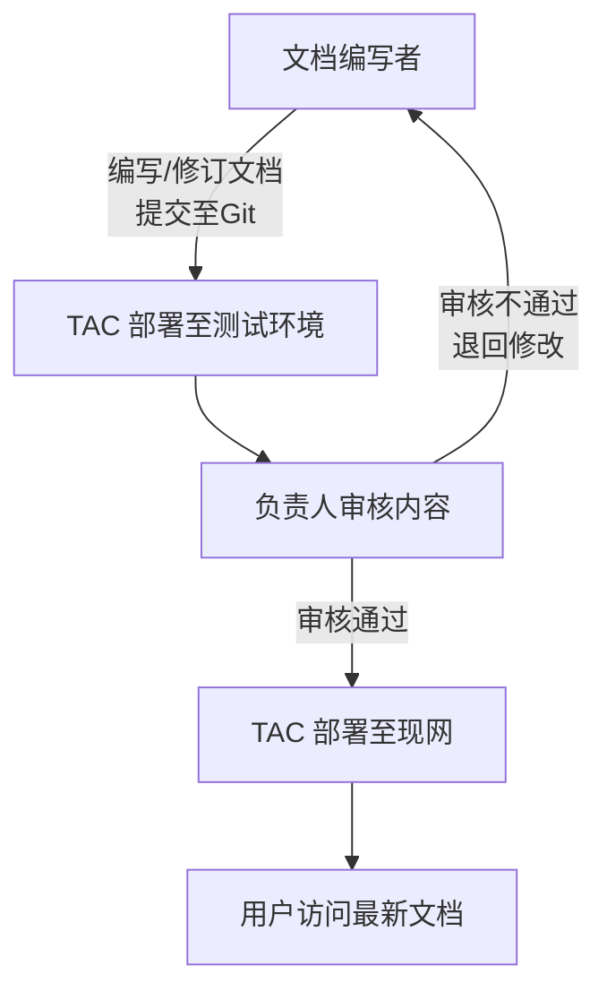

# 流程

## 工具选择

在门户规划中，文档中心功能是一个重要组成部分，主要包含 **用户指南、常见问题、条款与协议** 等静态页面。  
结合以往积累及行业实践，推荐使用 **Writerside** 作为文档编写与维护工具，原因如下：

- **专业性强**：专为技术文档与用户手册编写设计，支持结构化文档管理。
- **版本管理友好**：原生支持与 Git 深度集成，适合多角色协作与版本追踪。
- **格式统一**：提供统一的模板及样式，确保文档在不同版本和页面中风格一致。
- **快速部署**：文档内容可直接打包为静态页面，方便在门户内集成与发布。

## 文档流程规划

### 角色分工

- **文档编写者（产品、运营）**：负责文档撰写、修订与初步自测。
- **TAC（技术支持团队）**：负责部署至测试环境和正式环境。
- **负责人（或文档审核人）**：在测试环境中进行内容审核及发布确认。

### 流程步骤

1. **文档编写（修订）**
    - 使用 **Writerside** 编写或修订文档。
    - 提交修改至 Git 仓库。

2. **测试环境部署**
    - TAC 团队拉取最新版本文档，部署至测试环境。
    - 确保页面显示、链接、排版正确。

3. **内容审核**
    - 负责人在测试环境中审核文档内容，确认无误。

4. **现网部署**
    - 审核通过后，TAC 团队部署文档至现网（正式环境）。
    - 门户用户可直接访问最新版本的文档。

## 流程图

